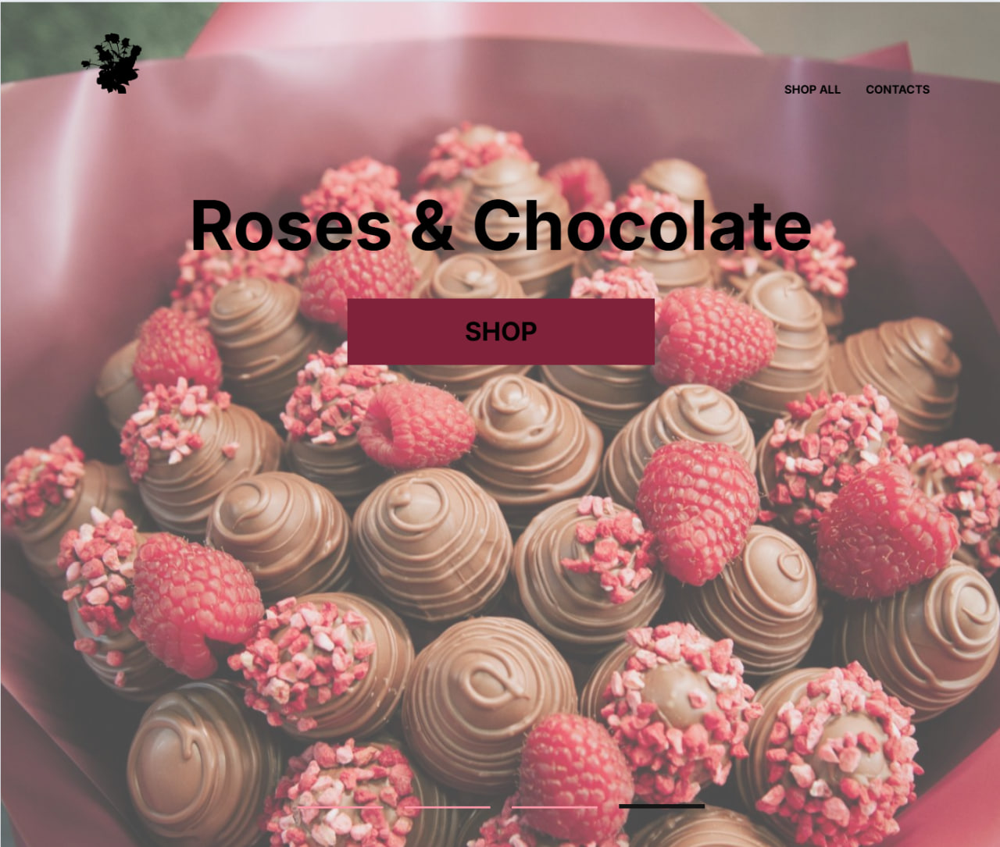

# Roses & Chocolate

Responsive landing page for a flower and chocolate gift shop built with HTML, CSS and JavaScript.

## Live Demo

[View Live Demo](https://alenagennadevna.github.io/roses-chocolate-landing/)

## Preview



## Features

- Responsive layout for desktop and mobile devices
- Interactive image slider
- Product categories
- Burger navigation menu
- Semantic HTML
- Smooth user experience

## Technologies

- HTML5
- CSS3
- JavaScript
- Swiper.js

## Project Structure

```text
css/
js/
images/
index.html
contacts.html
new-list.html
```

## Author

**Alena Bogdashkina**

GitHub:
https://github.com/AlenaGennadevna
